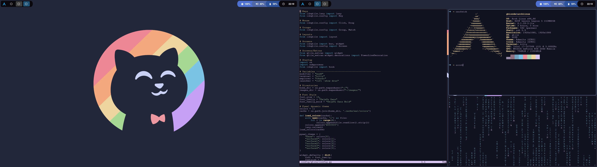
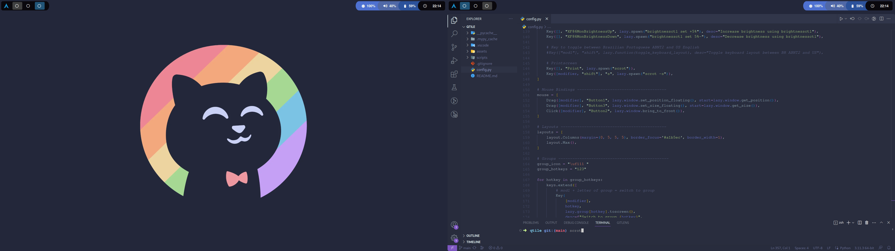

## Dotfiles
Still updating it!  
Initially based on <a href="https://github.com/Comfy-Themes/Spicetify"> this theme (comfy/spicetify) </a> and on <a href="https://www.reddit.com/r/unixporn/comments/13dm9g0/qtile_cozytile_a_cozy_qtile_rice/"> this rice (cozy-qtile by u/Darkkal_44)</a> from <a href="https://www.reddit.com/r/unixporn/">r/unixporn</a> community. 

## Screenshots

## Build
**Distro:** Arch Linux  
**WM:** qtile  
**Compositor:** jonaburg-picom fork  
**Terminal:** kitty  
**Shell:** zsh + oh-my-zsh  
**Dependencies:** feh, scrot, amixer, brightnessctl, setxkbmap, thunar, ttf-nerd-fonts-symbols.  
