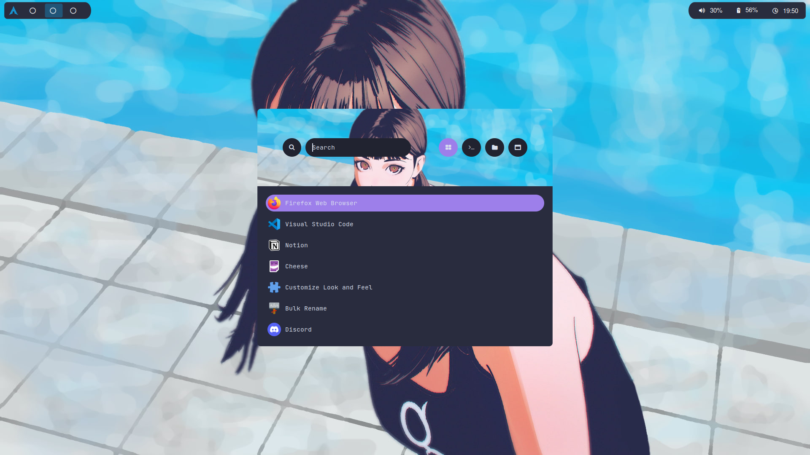
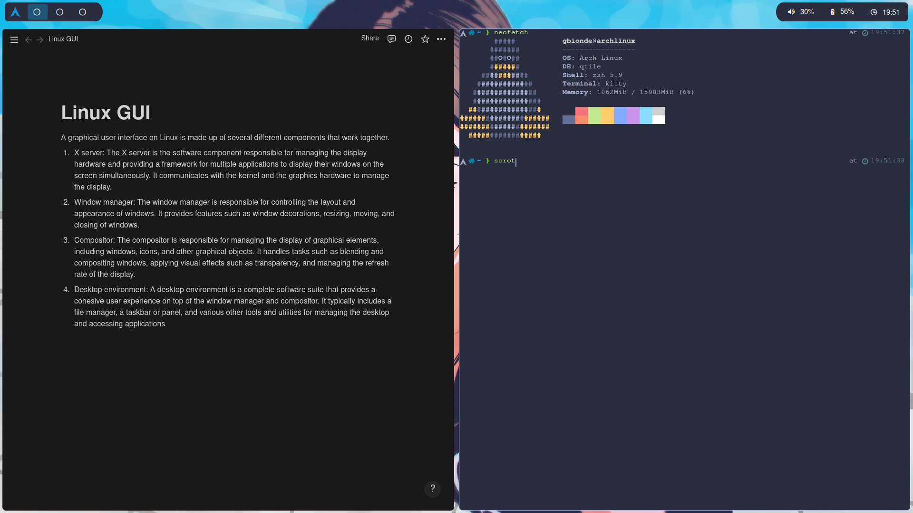

## Dotfiles
**Distro:** Arch Linux  
**WM:** qtile  
**Compositor:** jonaburg-picom fork  
**Terminal:** kitty  
**Shell:** zsh + oh-my-zsh  
**Dependencies:** feh, scrot, pywal, amixer, brightnessctl, setxkbmap, thunar, ttf-nerd-fonts-symbols.  

## Screenshots

